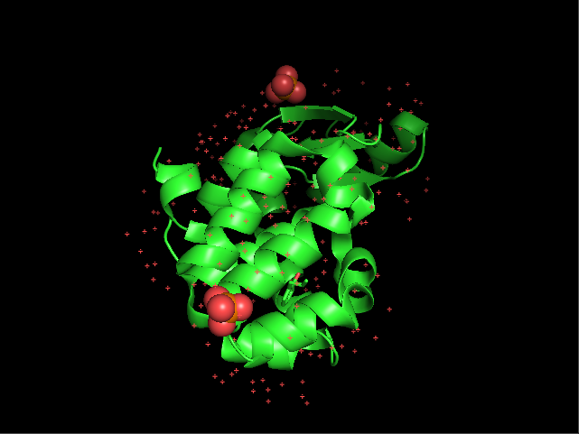
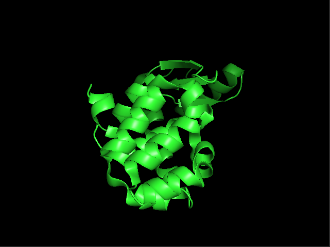
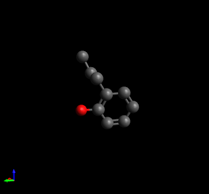
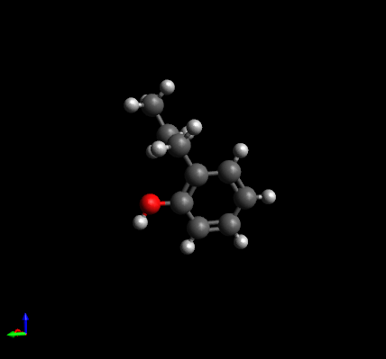

# GROMACS蛋白质配体模拟

## 数据准备

我们关注的是3HTB和JZ4的结合，因此我们需要从[RCSB](https://www.rcsb.org/ "RCSB")下载蛋白质pdb文件，这里选择PDB ID是3HTB的蛋白质。可以从download下载全部的蛋白质文件，也可以直接搜索PDB ID下载

<p align="center"></p>

3HTB.pdb中包含了3HTB和它所能结合的所有配体的信息，其中包括JZ4的信息。由于GROMACS提供的所有力场都不能识别JZ4配体，因此我们需要分别来准备蛋白质和配体的拓扑文件。

## 准备蛋白质拓扑文件

### 准备蛋白质pdb文件

* 在准备蛋白质文件之前，我们需要先将pdb文件中关于JZ4的信息提取出来。进入ubuntu系统，输入命令保存JZ4.pdb文件
  
  ```
  grep JZ4 3htb.pdb > jz4.pdb
  ```

* 用PyMOL删除结晶水和配体信息。但是不一定所有的蛋白质处理过程都会删除结晶水，需要根据要求来进行处理。
  
  1、在命令框中输入“cd E:\pymol\3HTB”跳转到pdb文件所在文件夹。

  2、从File中选Open，打开pdb文件。

  3、红色的十字标就是结晶水。

  4、从A中选择remove waters来删除结晶水。

  5、从命令框中输入“indicate hetatm”，选出全部的hetatm，然后选择remove atoms，删除hetatm。其实结晶水也包括在hetatm中。

  6、从File中选择Expert Molecule来保存文件，保存类型要选择PDB。

  <p align="center"></p>
  <p align="center"></p>

* 有时候pdb文件会有氨基酸原子缺失，必须要将他们补充上。使用SPDBV打开pdb文件就可以直接补充缺失的原子。然后选择保存（File->Save->Current Layer）即可。

### 准备力场文件

* 在GROMACS中，已经封装了许多力场，根据需要去选择合适的力场。由于蛋白质配体结合更适合用CHARMM36力场，因此需要从[CHARMM36官网](http://mackerell.umaryland.edu/charmm_ff.shtml#gromacs "CHARMM36官网")下载最新的CHARMM36力场。

* 下载力场压缩包后，放到GROMACS的力场文件夹中，一般是在“/usr/local/gromacs/share/gromacs/top”里面（找不到也没关系，直接在下一步生成拓扑文件时，会让你选择力场文件，这时他会告诉你力场文件的文件夹位置。然后“ctrl+c”退出来，进入力场文件夹添加力场即可）。在ubuntu中执行命令安装
  
  ```
  tar -zxvf charmm36-jul2022.ff.tgz
  ```

### 生成蛋白质拓扑文件

* 输入命令生成蛋白质拓朴文件
  
  ```
  gmx pdb2gmx -f 3htb_clean.pdb -o 3htb_processed.gro
  ```

  需要注意的是，可能会显示“-bash: gmx: command not found”。这时候就需要激活一下GROMACS

  ```
  source /usr/local/gromacs/bin/GMXRC
  ```

* 选择力场
  
  ```
  Select the Force Field:
  From '/usr/local/gromacs/share/gromacs/top':
  1: AMBER03 protein, nucleic AMBER94 (Duan et al., J. Comp. Chem. 24, 1999-2012, 2003)
  2: AMBER94 force field (Cornell et al., JACS 117, 5179-5197, 1995)
  3: AMBER96 protein, nucleic AMBER94 (Kollman et al., Acc. Chem. Res. 29, 461-469, 1996)
  4: AMBER99 protein, nucleic AMBER94 (Wang et al., J. Comp. Chem. 21, 1049-1074, 2000)
  5: AMBER99SB protein, nucleic AMBER94 (Hornak et al., Proteins 65, 712-725, 2006)
  6: AMBER99SB-ILDN protein, nucleic AMBER94 (Lindorff-Larsen et al., Proteins 78, 1950-58, 2010)
  7: AMBERGS force field (Garcia & Sanbonmatsu, PNAS 99, 2782-2787, 2002)
  8: CHARMM36 all-atom force field
  9: CHARMM27 all-atom force field (CHARM22 plus CMAP for proteins)
  10: GROMOS96 43a1 force field
  11: GROMOS96 43a2 force field (improved alkane dihedrals)
  12: GROMOS96 45a3 force field (Schuler JCC 2001 22 1205)
  13: GROMOS96 53a5 force field (JCC 2004 vol 25 pag 1656)
  14: GROMOS96 53a6 force field (JCC 2004 vol 25 pag 1656)
  15: GROMOS96 54a7 force field (Eur. Biophys. J. (2011), 40,, 843-856, DOI: 10.1007/s00249-011-0700-9)
  16: OPLS-AA/L all-atom force field (2001 aminoacid dihedrals)
  ```

  这里第8个就是我们添加的力场，输入8即可。

* 选择水模型
  
  这里选择默认的水模型即可，也就是CHARMM的TIP3P

  ```
  Select the Water Model:
  1: TIP3P      CHARMM-modified TIP3P water model (recommended over original TIP3P)
  2: TIP3P_ORIGINAL Original TIP3P water model
  3: SPC        SPC water model
  4: SPCE       SPC/E water model
  5: TIP5P      TIP5P water model
  6: TIP4P      TIP4P water model
  7: TIP4PEW    TIP4P/Ew water model
  8: None
  ```

  最后生成三个文件3htb_processed.gro、posre.itp、topol.top。

## 准备配体分子拓扑文件

实际上，可以从RCSB中下载到配体分子的mol2文件

### 添加氢原子

* 由于一般晶体结构中不包含氢原子，但是CHARMM是全原子力场，因此需要补充氢原子。使用[Avogadro软件](https://sourceforge.net/projects/avogadro/ "Avogadro软件")Avogadro软件来添加氢原子。

* 进入Avogadro，打开之前做好的jz4.pdb，然后选择“Buid->Add Hydrogens”。最后保存为mol2文件。
  
  <p align="center"></p>
  <p align="center"></p>

### 修改mol2文件

* 生成的jz4.mol2文件需要对几个地方进行修改，首先要用"JZ4"代替原来的“*****”
  
  ```
  @<TRIPOS>MOLECULE
  *****
  ```

  ```
  @<TRIPOS>MOLECULE
  JZ4
  ```

* 修改残基名称和残基序号，例如
  
  ```
  ...
  10 OAB        23.4120  -23.5360   -4.3420 O.3   167  JZ4167     -0.5065
  11 H          25.3133  -24.3619    0.1509 H       1  UNL1        0.0230
  ...
  ```

  ```
  ...
  10 OAB        23.4120  -23.5360   -4.3420 O.3     1  JZ4        -0.5065
  11 H          25.3133  -24.3619    0.1509 H       1  JZ4         0.0230
  ...
  ```

* 使用[sort_mol2_bonds.pl](http://www.mdtutorials.com/gmx/complex/Files/sort_mol2_bonds.pl "sort_mol2_bonds.pl")对“@<TRIPOS>BOND”的键进行升序排列。在ubuntu中执行命令
  
  ```
  perl sort_mol2_bonds.pl JZ4/jz4.mol2 JZ4/jz4_fix.mol2
  ```

* 使用[CGenFF](https://cgenff.umaryland.edu/initguess/ "CGenFF")生成配体分子的拓扑文件，CGenFF是一个在线网站，直接上传mol2文件就可以生成CHARMM的"stream"文件。需要注意的是，这里使用的jz4_fix.mol2中的氢原子名称都是H，因此需要先把jz4_fix.mol2的氢原子H后面加上数字，然后再用CGenff生成拓扑文件。

* 使用cgenff_charmm2gmx_py3_nx2.py脚本将jz4.str转换为GROMACS可识别的文件，要注意的是需要先安装networkx 2.3。
  
  ```
  python cgenff_charmm2gmx_py3_nx2.py JZ4 JZ4/jz4_fix.mol2 JZ4/jz4.str /usr/local/gromacs/share/gromacs/top/charmm36.ff
  ```

  输出下面的信息后，说明转换成功

  ```
  ============ DONE ============
  Conversion complete.
  The molecule topology has been written to jz4.itp
  Additional parameters needed by the molecule are written to jz4.prm, which needs to be included in the system .top
  
  PLEASE NOTE: If your topology has lone pairs, you must use GROMACS version 2020 or newer to use 2fd construction
  Older GROMACS versions WILL NOT WORK as they do not support 2fd virtual site construction
  ============ DONE ============
  ```

  一共输出四个文件：jz4.top、jz4.itp、jz4_ini.pdb、jz4.prm。

## 构建蛋白质配体复合物

* 将jz4_ini.pdb转为gro格式，并和3HTB_processed.gro进行拼接，最后修改原子个数为2636
  
  ```
  gmx editconf -f JZ4/jz4_ini.pdb -o JZ4/jz4.gro
  ```

  ```
  ...
  163ASN     O1 1692   0.624  -0.616  -0.140
  163ASN     O2 1693   0.683  -0.703  -0.011
  1JZ4     C4    1   2.429  -2.412  -0.007
  1JZ4     C7    2   2.155  -2.721  -0.411
  ...
  ```

* 构建拓扑文件只需要修改topol.top即可，在最后添加“#include "jz4.itp"”，在顶端添加jz4.prm的二面角信息，同时需要在[ molecules ]中加入配体分子。
  
  ```
  ; Include Position restraint file
  #ifdef POSRES
  #include "posre.itp"
  #endif
  
  ; Include ligand topology
  #include "jz4.itp"
  
  ; Include water topology
  #include "./charmm36-mar2019.ff/tip3p.itp"
  ```

  ```
  ; Include forcefield parameters
  #include "./charmm36-mar2019.ff/forcefield.itp"
  
  ; Include ligand parameters
  #include "jz4.prm"
  
  [ moleculetype ]
  ; Name            nrexcl
  Protein_chain_A     3
  ```

  ```
  [ molecules ]
  ; Compound        #mols
  Protein_chain_A     1
  JZ4                 1
  ```

## 溶剂化

* 定义模拟盒子并添加水
  
  ```
  gmx editconf -f complex.gro -o newbox.gro -bt dodecahedron -d 1.0
  gmx solvate -cp newbox.gro -cs spc216.gro -p ../3HTB/topol.top -o solv.gro
  ```

## 添加离子

* 体系中溶剂化的蛋白质是带电荷的，从topol.top文件中的[ atoms ]中的最后一行可以看到qtot 6，说明体系中总电荷是6，需要加入离子平衡电荷。首先下载[ions.mdp](http://www.mdtutorials.com/gmx/complex/Files/ions.mdp "ions.mdp")文件，然后执行命令
  
  ```
  gmx grompp -f ions.mdp -c solv.gro -p topol.top -o ions.tpr
  ```

* 把得到的tpr文件传递给genion
  
  ```
  gmx genion -s ions.tpr -o solv_ions.gro -p topol.top -pname NA -nname CL -neutral
  ```

  这时会问我们用什么分子来替换成氯离子，我们选择13，也就是水分子

  ```
  Will try to add 0 NA ions and 6 CL ions.
  Select a continuous group of solvent molecules
  Group     0 (         System) has 33521 elements
  Group     1 (        Protein) has  2614 elements
  Group     2 (      Protein-H) has  1301 elements
  Group     3 (        C-alpha) has   163 elements
  Group     4 (       Backbone) has   489 elements
  Group     5 (      MainChain) has   651 elements
  Group     6 (   MainChain+Cb) has   803 elements
  Group     7 (    MainChain+H) has   813 elements
  Group     8 (      SideChain) has  1801 elements
  Group     9 (    SideChain-H) has   650 elements
  Group    10 (    Prot-Masses) has  2614 elements
  Group    11 (    non-Protein) has 30907 elements
  Group    12 (          Other) has    22 elements
  Group    13 (            JZ4) has    22 elements
  Group    14 (          Water) has 30885 elements
  Group    15 (            SOL) has 30885 elements
  Group    16 (      non-Water) has  2636 elements
  Select a group: 15
  ```

## 能量最小化

* 对体系solv_ions.gro进行能量最小化设置，首先下载[em.mdp](http://www.mdtutorials.com/gmx/complex/Files/em.mdp "em.mdp")文件，然后执行命令
  
  ```
  gmx grompp -f em.mdp -c solv_ions.gro -p topol.top -o em.tpr
  ```

  运行报错 “No such moleculetype CL”，将topol.top文件和solv_ions.gro文件中[ molecules ]部分下的CL改为CLA。同时需要注意solv_ions.gro的缩进要保持格式规范。

* 然后调用mdrun进行能力最小化
  
  ```
  gmx mdrun -v -deffnm em
  ```

## 平衡

### 约束配体

* 给配体创建一个包含氢原子之外的所有原子索引组
  
  ```
  gmx make_ndx -f jz4.gro -o index_jz4.ndx
  ...
   > 0 & ! a H*
   > q
  ```

* 执行genrestr模块，然后选择刚才得到的索引组，是group 3
  
  ```
  gmx genrestr -f jz4.gro -n index_jz4.ndx -o posre_jz4.itp -fc 1000 1000 1000
  ```

* 把信息添加到拓扑文件中
  
  ```
  ; Include Position restraint file
  #ifdef POSRES
  #include "posre.itp"
  #endif
  
  ; Include ligand topology
  #include "jz4.itp"
  
  ; Ligand position restraints
  #ifdef POSRES
  #include "posre_jz4.itp"
  #endif
  
  ; Include water topology
  #include "./charmm36-mar2019.ff/tip3p.itp"
  ```

### 热浴

* 控制温度耦合，但是不要单独耦合体系中的每一种分子。首先创建一个组合了蛋白质和配体的特殊索引组。可以通过make_ndx处理任意一个包含完整体系的坐标文件来实现，并合并蛋白质和JZ4.
  
  ```
  gmx make_ndx -f em.gro -o index.ndx
  ...
   > 1 | 13
   > q
  ```

* 在[nvt.mdp](http://www.mdtutorials.com/gmx/complex/Files/nvt.mdp "nvt.mdp")设置"tc-grps = Protein_JZ4 Water_and_ions"，并执行NVT平衡。
  
  ```
  gmx grompp -f nvt.mdp -c em.gro -r em.gro -p topol.top -n index.ndx -o nvt.tpr
  gmx mdrun -deffnm nvt
  ```

  奇怪的是，我生成的index.ndx中并没有Water_and_ions，因此在执行上述命令时会报错。我的做法是合并水和氯离子，自己创建CLA_Water。

* 用[npt.mdp](http://www.mdtutorials.com/gmx/complex/Files/npt.mdp "npt.mdp")执行NPT平衡。
  
  ```
  gmx grompp -f npt.mdp -c nvt.gro -t nvt.cpt -r nvt.gro -p topol.top -n index.ndx -o npt.tpr
  gmx mdrun -deffnm npt
  ```

## MD模拟

用[md.mdp](http://www.mdtutorials.com/gmx/complex/Files/md.mdp "md.mdp")执行NPT平衡。

```
gmx grompp -f md.mdp -c npt.gro -t npt.cpt -p topol.top -n index.ndx -o md_0_10.tpr
gmx mdrun -deffnm md_0_10
```

## PyMOL可视化轨迹

* 先将复合物放到之前定义的盒子中间
  
  ```
  gmx trjconv -s md_0_10.tpr -f md_0_10.xtc -o md_0_10_center.xtc -center -pbc mol -ur compact

  ```

* 获取轨迹的第一帧
  
  ```
  gmx trjconv -s md_0_10.tpr -f md_0_10_center.xtc -o start.pdb -dump 0
  ```

* 打开PyMOL，加载start.pdb，然后加载轨迹文件md_0_10_center.xtc
  
  ```
  load_traj md_0_10_center.xtc,start=1,stop=10000000,interval=20
  ```

* 大功告成
  
  <p align="center"></p>